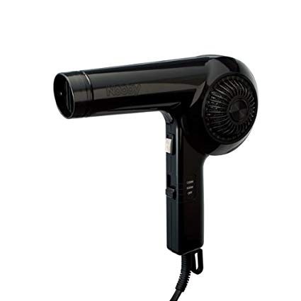

dyson supersonicを買って大満足した話。

# ドライヤへの不満

Nobby NB1902というドライヤを使っていた。

[https://www.nobby-pro.jp/products/pdf/NB1902.pdf](https://www.nobby-pro.jp/products/pdf/NB1902.pdf)

風量多めで、フィルタ掃除しやすく、それなりに気に入っていた。ネット情報だと、美容師御用達メーカーらしい。

ただ、このドライヤに限った話ではないが、夏場に使っていると汗だくになる。風呂上がりに髪を乾かすためにドライヤを使っているのに、ドライヤの熱風で汗が出てくる地獄の無限ループに陥る。自分は結構汗っかきなので、多分人より苦しんでいるだろう。これからまた暑い時期が来るので、いい加減なんとかしたいと思っていた。

そんなとき、ネットでdyson supersonicの記事を見た。風量がかなり多めで、熱風で乾かすのではなく、風量で乾かす設計らしい。ひと目で興味を惹かれた。

# まずはwebで調査

ノーズと呼ばれる部分がないのが特徴。dysonお得意のモーター技術でノーズなしの形状のできたとか。正直ノーズがあることに、それほど不満はないが、ノーズレスを使うとまた違う感想を得るのだろうか。

外観もメタリックな感じでかっこいい。

風量は2.4 m^3^/min。そう言われてもいま使っているものの風量スペックが記載されていないので、比較しようがない。

温度設定は初期モデルは最大78 ℃だったが、次期モデルはスタイリングのしやすさのために100 ℃になっているとか。まあ、温度設定を4段階でできるので、冬は高め、夏は低めとかにすればいい。温度制御は中に入っているICでやっているらしい。なんかこういう電子制御って信頼性下がりそうで嫌なんだけどな。まあ、そんなのは昔の話か。1秒に20回測定とか言っているが、別にすごくないし。普通に温度測定が必要な工業製品ではよくやってるレベル。むしろこれを誇っちゃうくらい、程度の低い製品しかない業界なんだろうか。

掃除のしやすさも悪くなさそう。持ちての下の方が吸気口になっており、そこの金属フィルタをマメに拭き掃除すればいいだけ。メンテナンスしやすい or メンテナンスがいらない製品以外買いたくない。購入のための初期費用を下げるために、メンテナンスなどのランニングコストをあげるのは、個人的にはありえないと考えている。

# 家電量販店に実機を見に行く

近くのヨドバシとビックに行って、実機を見てきた。

風量が多めとのことだが、正直よくわからなかった。比較対象が手元になかったため。ただ、温度調整や風量調整が手元のボタンで簡単にできることがわかった。

# 代替案

実機調査で見つけた。cadoのcuauraというもの。同じノーズレスで風量多めのもの。ただ、温度調整が出来なさそうだったので、却下。

ていうか、cadoってdysonのパクリメーカなのか? てくらいコンセプトが似てる。発売時期から考えて、cadoがパクってるんだろう。

あとここの加湿器を持っているが、外観にこだわりがあるのはいいが、掃除のことをあまり考えておらず、メンテナンス性は決して高くない。角をなくして拭きやすくしたって言ってるけど、吸気口のフィルタのメンテナンス性をもっと考えてほしい。爪がありえないほどめっちゃ硬い上に、フィルタが軟弱すぎてすぐちぎれる。 もうめんどくさいから、吸気口を含め、底面全体を汎用フィルタで覆って使用している。見た目が若干悪いが、メンテナンス性のためだ。

# 買うか悩む

1か月悩んだ。原因は値段。5万円は流石に高すぎるだろ。ドライヤなんて1万円もしないものという認識だったから、相当悩んだ。試しに買ってしばらく使ってみて、だめだったらオークションとかで売ればいいと思ったが、それでも踏ん切りがつかなかった。なにより、いま使っているドライヤはまだ全然壊れる気配がないし、夏の汗だく無限ループ地獄以外は特に不満がなかった。

# 買った

結局買った。普段買い物はAmazonで済ませているが、実はヨドバシやビックの通販のほうが安かったり品揃えが豊富だったりすることに最近気づいて、Amazonですぐ買うのではなく、ヨドバシやビックも探すようにしている。こないだはハンドクリームをヨドバシで買った。Amazonには普段使っていたやつが売られなくなっていたが、ヨドバシでは普通にあった。

早速使ってみた。風量は明らかに違った。dyson supersonicの方が明らかに多い。温度設定を2番目に低い温度にして使った。風呂上がりにすぐに使ってみたが、汗をかかないどころか、風呂上がりの暑い体を冷ましてくれさえした。それほど低温にもかかわらず、有り余る風量で髪がどんどん乾いていった。これこそまさに求めていたドライヤだ。

ということで、大満足。夏場に汗だくになりながら髪を乾かすために消耗している人がいたら、ぜひ検討してみてほしい。値段は確かに高いが、今後何年も夏場に地獄を見るくらいなら、購入する価値はある。